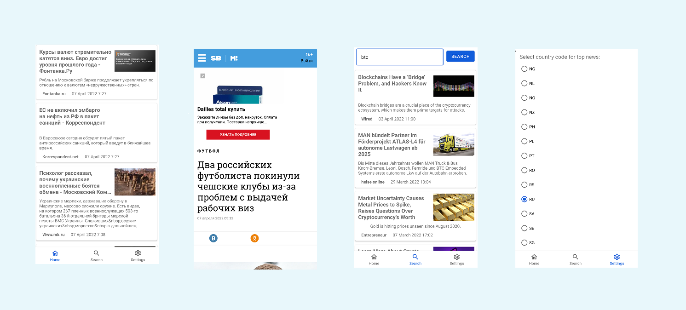

# Currency converter

Данное приложение загружает список последних актуальных новостей. В настройках есть возможность выбора страны по умолчанию. Для ручного обновления данных нужно свайпнуть экран. Если нажать на новость она откроется в WebView. На вкладке поиск реализована возможность поиска новостей по ключевым словам

При реализации данного приложения использованы: паттерн CleanArchitecture, паттерн MVVM, Retrofit2, Dagger2, LiveData, ViewModel, Coroutines, Room, ViewBinding, Preferences DataStore, Paging3

# Технологии

* Retrofit HTTP клиент для Android который позволяет легко загружать данные и преобразовывать их в сущности с помощью библиотеки GSON
* Dagger используется для инъекции зависимостей
* LiveData инструмент для связывания данных и объектов с жизненным циклом
* ViewModel для управления данными, связанных с пользовательским интерфейсом
* Coroutines для написания асинхронного кода, неблокирующего поток
* Room обертка над БД SQLite
* ViewBinding инструмент который проще позволяет взаимодействовать с View
* Preferences DataStore  инструмент для хранения данных по принципу "ключ - значение"
* Paging3 для порционной загрузки данных